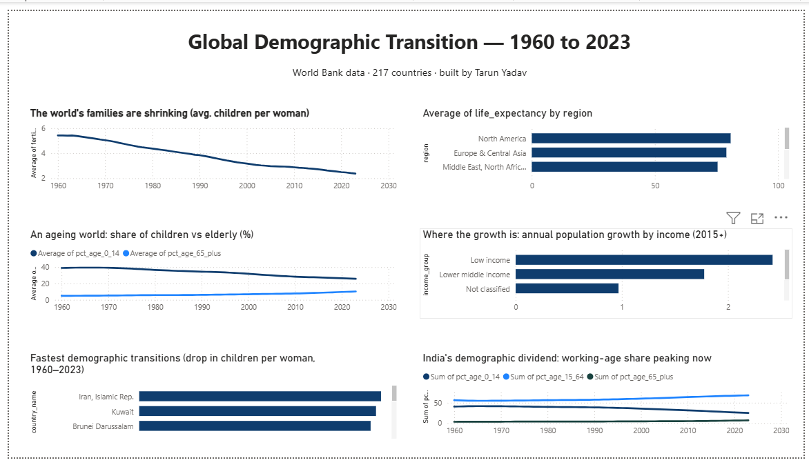

# The Global Demographic Transition

**Who's aging, who's booming, and where does India stand?**
A data-analytics study of 60+ years of demographic change across 200+ countries.



---

## What I set out to do

I kept seeing headlines about the world "getting old" while other countries are still
booming, and I wanted to check that against the actual numbers instead of taking it on faith.
So I framed it the way someone managing money over a long horizon would: which countries are
going to have a young, growing workforce, which ones are heading into an ageing problem, and —
the part I was most curious about — where India actually fits in all of this.

To get there I pulled 11 demographic indicators for 200+ countries straight from the World
Bank API (going back to 1960), cleaned them into a star-schema so they were easy to query,
wrote a set of SQL queries to pull out the trends, and built a Power BI dashboard to turn it
into a story you can actually see.

**How it turned out:** the numbers were striking — global fertility has roughly halved
(5.3 → 2.4 births per woman). I could rank which regions are youngest and oldest, spot which
countries are ageing fastest, and show that India's working-age share is peaking right about
now. I also tried to stay honest about the limits — for example I used unweighted country
averages, which I call out in the methodology rather than hide.

---

## The brief (business context)

> A client managing a 25-year global infrastructure & equities fund needs to know
> which countries will have a **young, growing workforce** (good for labour supply
> and consumer markets) versus which face an **aging crisis** (rising healthcare and
> pension costs, shrinking workforce). They also want a clear read on **where India
> sits** in this window of opportunity.

Putting myself in the analyst's seat, these are the questions I wanted to answer:

1. How has the world moved through the "demographic transition" since 1960?
2. Which regions / income groups are **youngest** and which are **oldest** today?
3. Which countries are aging **fastest**, and who still has a **demographic dividend**?
4. Where is **India** in this story — and how long is its workforce window open?

---

## Data source

| | |
|---|---|
| **Source** | [World Bank Open Data](https://data.worldbank.org/) (compiled from UN World Population Prospects & national statistics offices) |
| **Access** | Public REST API — no key required. Downloaded reproducibly via `scripts/01_download_data.py` |
| **Coverage** | 217 countries + 79 aggregates, years **1960–2023** |
| **Why this source** | Authoritative, government/UN-grade, free, transparent methodology. No fabricated or scraped data. |

### Data dictionary (the 11 indicators)

| Column | Meaning | Units |
|---|---|---|
| `population_total` | Total population | people |
| `population_growth_pct` | Annual population growth | % |
| `fertility_rate` | Births per woman over her lifetime | births |
| `life_expectancy` | Life expectancy at birth | years |
| `birth_rate` | Live births per 1,000 people | per 1,000 |
| `death_rate` | Deaths per 1,000 people | per 1,000 |
| `pct_age_0_14` | Share of population aged 0–14 (children) | % |
| `pct_age_15_64` | Share aged 15–64 (working-age) | % |
| `pct_age_65_plus` | Share aged 65+ (elderly) | % |
| `urban_population_pct` | Share living in urban areas | % |
| `dependency_ratio` | Dependents (under-15 + over-64) per 100 working-age | ratio |

**A few concepts I had to be solid on going in:**
- **Replacement-level fertility ≈ 2.1.** Below this, a population eventually shrinks without immigration.
- **Demographic dividend:** the growth boost a country gets while it has a large working-age share and few dependents.
- **Aging:** rising `pct_age_65_plus` and `dependency_ratio` → pressure on pensions & healthcare.

---

## Key findings

> All figures below are produced reproducibly by the SQL queries in `sql/`.
> "Average" means the average across countries unless stated otherwise.

**1. The world's families have nearly halved in size.** Average fertility fell from
**5.31 children per woman in the 1960s to 2.44 in the 2020s** — that puts it right up
against the ~2.1 "replacement" level where a population stops growing. This was the one
that surprised me most when I first ran the query.
→ `sql/01_global_fertility_decline.sql`

**2. People live far longer — but how long depends heavily on where you're born.**
What stood out here was the size of the gap. In 2023, average life expectancy ran from
**80.8 years in North America** down to **64.6 in Sub-Saharan Africa** — roughly
**16 years** apart depending on where you happen to be born.
→ `sql/02_life_expectancy_by_region.sql`

**3. The world is ageing.** I could see it from both ends at once: the share of children
(0–14) fell from **39.4% (1960s) to 26.1% (2020s)**, while the elderly share (65+)
**doubled, from 5.1% to 10.0%**. Young and old are converging fast.
→ `sql/03_population_ageing.sql`

**4. Almost all future growth will come from the poorest countries.** Since 2015,
**low-income countries grew 2.42%/year** against just **0.52–0.63% in richer ones** —
about **4–5× faster**. To make that concrete, at 2.4%/yr a population doubles in about
29 years.
→ `sql/04_growth_by_income_group.sql`

**5. Some countries transformed within a single lifetime.** When I ranked the biggest
fertility collapses 1960→2023, the top of the list was **Iran (7.52 → 1.70)**, Kuwait,
and Brunei — and the leaderboard as a whole leaned heavily towards the Middle East/Gulf
and Latin America.
→ `sql/05_fastest_transition_countries.sql`

**6. India's demographic dividend is peaking right now — and it's time-limited.** This
was the question I cared about most. India's fertility fell from **5.88 to 2.01** (now
*below* replacement) and life expectancy rose **+24 years** (46.5 → 70.3). The part that
really landed for me: its **working-age share (15–64) is at an all-time high of 67.7%**,
so about 2 in 3 Indians are of working age today. But with fertility already below
replacement and the elderly share rising (3.5% → 6.6%), that window will start to close
over the coming decades. **India's opportunity is now.**
→ `sql/06_india_story.sql`

---

## Project structure

```
.
├── README.md                       <- the brief, data dictionary & key findings
├── data/
│   ├── raw/                         <- untouched API downloads (never edited by hand)
│   │   ├── worldbank_indicators_raw.csv
│   │   └── worldbank_countries_raw.csv
│   └── processed/                   <- analysis-ready outputs
│       ├── dim_country.csv          <- country dimension (217 real countries)
│       ├── fact_demographics.csv    <- fact table (13,888 country-year rows)
│       └── demographics.db          <- SQLite database queried in the analysis
├── scripts/
│   ├── 01_download_data.py          <- pulls real data from the World Bank API
│   ├── 02_clean_data.py             <- cleans, removes aggregates, builds star schema
│   ├── 03_load_to_sqlite.py         <- loads the clean tables into a SQLite database
│   └── run_sql.py                   <- helper: runs any .sql file against the database
├── sql/                             <- the analysis, one question per file
│   ├── 01_global_fertility_decline.sql
│   ├── 02_life_expectancy_by_region.sql
│   ├── 03_population_ageing.sql
│   ├── 04_growth_by_income_group.sql
│   ├── 05_fastest_transition_countries.sql
│   └── 06_india_story.sql
└── powerbi/
    └── Global Demographics.pbix     <- interactive one-page dashboard (6 visuals + region slicer)
```

## How to reproduce

```bash
# one-time setup
python -m venv .venv && source .venv/bin/activate    # Windows: .venv\Scripts\activate
pip install -r requirements.txt

# build the data
python scripts/01_download_data.py      # raw data   -> data/raw/
python scripts/02_clean_data.py         # clean data -> data/processed/
python scripts/03_load_to_sqlite.py     # build the SQLite database

# then run any analysis query, e.g.:
python scripts/run_sql.py sql/06_india_story.sql
```

## Methodology notes (the honest details)
- **Aggregates removed.** The raw data mixes 217 real countries with 79 groupings
  ("Euro area", "High income", etc.). I kept only the real countries in the analysis so
  totals and averages don't get double-counted.
- **Missing values left as NULL, not invented.** The gaps are small (≤1.8%, mostly the
  structural 1960 growth rate), and I excluded them from the averages rather than make up
  numbers to fill them.
- **Star schema.** I put country attributes in `dim_country` and the measurements in
  `fact_demographics`, joined on `country_code` — the layout BI tools expect.
- **Known caveat.** My cross-country averages weight every country equally, so tiny and
  huge countries count the same. That's a fair "average country" view, but it's worth
  being clear that it isn't the same as a population-weighted "average person" view.

## Progress log
- [x] **Step 1 — Data acquisition.** Wrote a reproducible download script that pulled 17,024 indicator rows plus the country metadata.
- [x] **Step 2 — Data cleaning & modeling.** Removed the aggregates, fixed the types, and built the star schema (217 countries × 13,888 facts); all my quality checks pass.
- [x] **Step 3 — Analysis & insights.** Built the SQLite database and wrote 6 documented SQL queries that produce the six key findings above.
- [x] **Step 4 — Power BI dashboard.** Built an interactive one-page dashboard (`powerbi/Global Demographics.pbix`): the six findings as visuals, a DAX measure for the fastest-transition leaderboard, and a region slicer that cross-filters the whole page.
